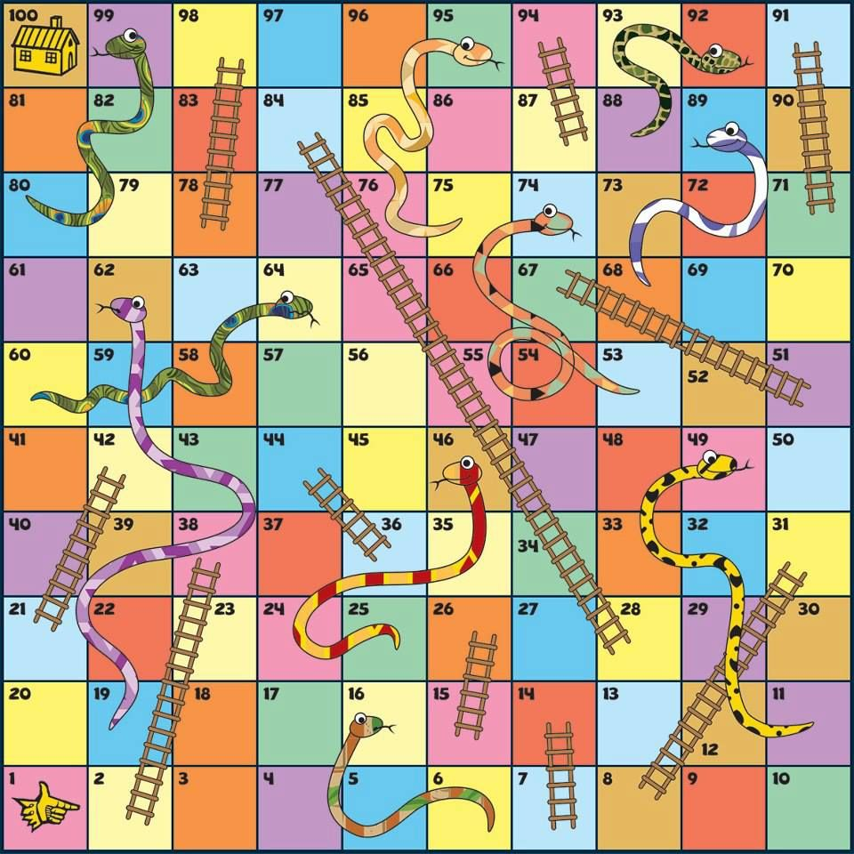

# cpp-snake

This is a simple snake & ladders simulation using OOP in cpp.




## Instructions

You can find the instructions for this activity [here](./assets/TC1030-t1-POO.pdf)

## Project Structure
```
PROJECT_ROOT
├── assets/
│   ├──   :
│   └──   :
├── bin/
├── include/
│   ├── Board.h
│   ├── Player.h
│   └── RNG.h
├── src/
│   ├── Board.cpp
│   ├── main.cpp
│   ├── Player.cpp
│   └── RNG.cpp
├── .gitignore
├── build.sh
└── README.md

```

## Compiling

To compile the project, run:

```bash
g++ -Iinclude src/*.cpp -o bin/main -o bin/main

./build.sh      # with shell scripts.
```

### Shell Scripts Usage

```shell
g++ -Iinclude src/*.cpp -o bin/main -o bin/main && ./bin/main
```

## Running

To run the project, first compile it, and then run:

```bash
bin/main
```
